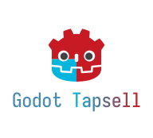
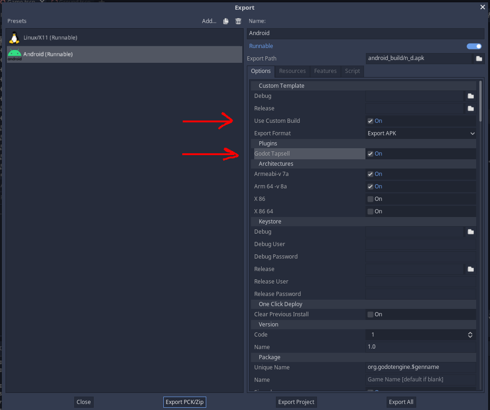

# GodotTapsell
<p align="center">
  
</p>

[Tapsell](https://tapsell.ir) ads implementation for the Godot game-engine.
Currently only supports rewarded video ads.

Tested on Godot 3.3.2 and Android Q

## Installation
1. Download the zip file provided [here](https://github.com/OverShifted/GodotTapsell/releases)
.
2. Extract `.arr` and `.gdap` files in `res://android/plugins` of your Godot project
3. Extract the `.gd` file in `res://commons` of your Godot project
4. Install Godot's "Android Build Template" using the `Project > Install Android Build Template...` menu entry in the Godot editor
5. Open `Project > Project Settings...`; head over to the Autoload tab and add the extracted script as an autoload with node name of `Tapsell`
6. Open `Project > Export...`. In your Android preset; enable the "Use Custom Build" and "Godot Tapsell" options.

    

## Usage
Specify your appid in the `Tapsell.gd` file.

### Video ad
Anywhere in your code:
```gd
Tapsell.request_video_ad("<zone id>")
```
Finally, in a `video_ad_request_response` [signal handler](https://docs.godotengine.org/en/3.6/getting_started/step_by_step/signals.html#connecting-a-signal-via-code) you can:
```gd
func on_video_ad_request_response(zone: String, id: String):
    Tapsell.show_video_ad(id)
```

### Standard banner ad
Anywhere in your code:
```gd
Tapsell.create_banner_frame(width, height, gravity)
Tapsell.request_banner_ad("<zone id>", banner_type)

# Example:
Tapsell.create_banner_frame(320, 150, Tapsell.GRAVITY_TOP)
Tapsell.request_banner_ad("<zone id>", Tapsell.BANNER_TYPE_320x50)
```
Then, in a `banner_ad_request_response` [signal handler](https://docs.godotengine.org/en/3.6/getting_started/step_by_step/signals.html#connecting-a-signal-via-code):
```gd
func on_banner_ad_request_response(zone: String, id: String):
    Tapsell.show_banner_ad(id)
```

Finally, to close the banner do this anywhere in your code:
```gd
Tapsell.destroy_banner_ad(id)
```
